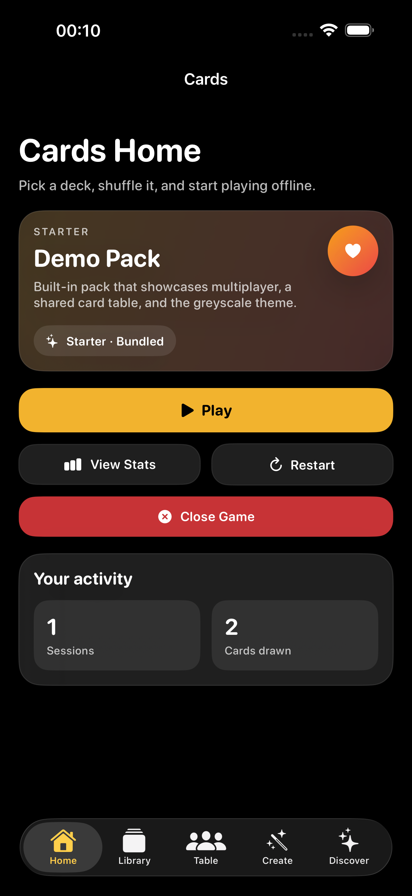
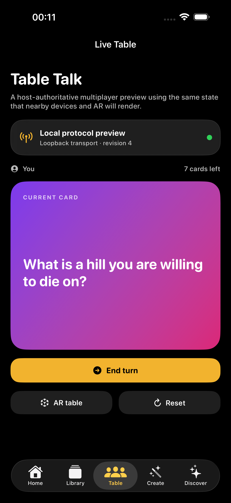
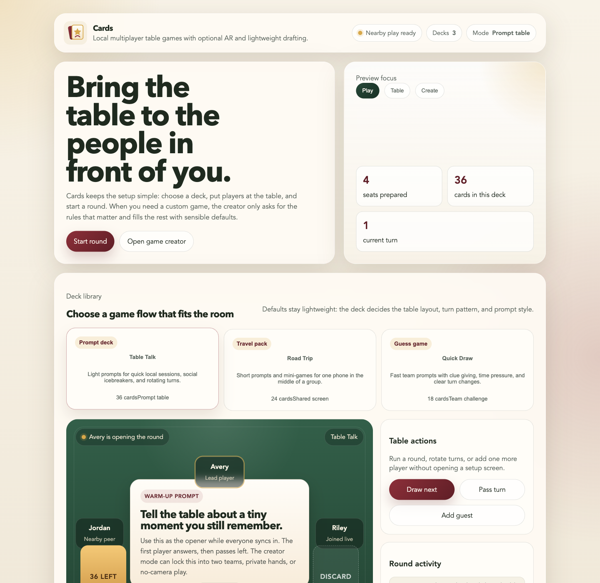
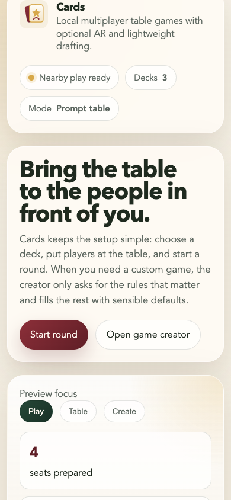

# Cards

Cards is a local-first platform for creating and playing card games on iPhone and Android. A game is a small validated manifest that selects a known gameplay template, bundled card resources, multiplayer capabilities, and a table design. The same deterministic state drives conventional screens and optional AR tables.

There is deliberately no large store and no general code-generating AI. The creator is a lightweight classifier and configuration interpreter: it recognises a game family, chooses tested defaults, applies explicit overrides, and rejects unknown resources.

## App preview

| iPhone home | iPhone live table |
| --- | --- |
|  |  |

| Browser preview — desktop | Browser preview — mobile |
| --- | --- |
|  |  |

Try the lightweight browser preview at [jakkuazzo.github.io/Cards_PythonQT_Demo](https://jakkuazzo.github.io/Cards_PythonQT_Demo/). It demonstrates the prompt deck, a local table flow, and constrained game-template selection; nearby transport and AR remain native-app capabilities.

## Preview downloads

Each version tag creates a GitHub prerelease with an Android debug APK, a macOS DMG, and a Windows executable. These preview builds are not code-signed or notarized. iOS distribution needs an Apple Developer account and is therefore intentionally not included yet.

## Current implementation

### Shared

- Closed JSON schemas for game manifests and network envelopes.
- An allowlisted resource catalogue for tables, card backs, and card sets.
- Poker, Guess Who, and prompt-draw template classification.
- A SplitMix64/Fisher-Yates shuffle fixture shared by Swift and Java.
- Host-authoritative revisions, ordered turns, snapshots/private-message protocol definitions, and validation tests.

### iPhone

- Existing offline classic and prompt decks.
- A working two-dimensional multiplayer Table Talk preview.
- Host/join controls for encrypted Apple-to-Apple nearby tables, with a shareable table code, host-authoritative commands, and revisioned snapshots.
- A tested loopback transport retained for deterministic automated tests.
- An ARKit/RealityKit table that finds a horizontal surface and renders the digital table/card state.
- A minimal creator that accepts an idea or YAML-style settings and previews validated prompt games.

### Android

- The same deterministic multiplayer engine and seed-42 conformance result as iOS.
- A conventional live-table activity.
- A Google Nearby Connections `P2P_STAR` host/join flow with visible authentication digits, table-code validation, host-authoritative commands, and public snapshots.
- Optional ARCore installation and session lifecycle with a non-AR fallback.

## Lightweight creator format

The interpreter can infer a template from an idea:

```yaml
idea: four-player poker night
multiplayer: y
max_user: 4
ar: n
tabledesign: poker_2.png
```

This selects the poker archetype, standard 52-card resource, two-card starting hands, nearby multiplayer, and the bundled `poker-2` table. Explicit settings override template defaults.

Guess Who selects a two-player character-grid configuration and bundled character set:

```yaml
idea: a nearby Guess Who game
```

Custom prompt games supply their own text cards:

```yaml
name: Road Trip Stories
players: 2-6
ar: y
tabledesign: green_classic.svg
- What is the funniest thing that happened on a journey?
- Which place would you revisit tomorrow?
```

The canonical machine-readable format is JSON; this small YAML-style syntax is only creator input. See [shared/game-manifest.schema.json](shared/game-manifest.schema.json), [shared/resources/catalog.json](shared/resources/catalog.json), and [shared/PROTOCOL.md](shared/PROTOCOL.md).

## Template status

| Template | Configuration | Runtime |
| --- | --- | --- |
| Prompt draw | Complete | Playable in the local multiplayer and AR previews |
| Poker | Complete defaults and resources | Dedicated dealing, community-card, betting, and hand-ranking runtime still required |
| Guess Who | Complete defaults and character resources | Dedicated private-target and character-grid runtime still required |

The creator does not label an unimplemented runtime as playable.

## Tests

Run all dependency-free conformance checks from the repository root:

```bash
# Shared JSON contracts
python3 -m unittest discover -s shared/tests -v

# Swift creator, shuffle, and multiplayer runtime
RUNNER="$(mktemp)"
xcrun swiftc \
  ios/CardsiOS/MultiplayerModels.swift \
  ios/CardsiOS/MultiplayerEngine.swift \
  ios/CardsiOS/GameDraftInterpreter.swift \
  tools/SwiftConformanceRunner.swift \
  -o "$RUNNER"
"$RUNNER"

# Android/Java core
BUILD_DIR="$(mktemp -d)"
javac -Xlint:all -Werror -d "$BUILD_DIR" \
  android/app/src/main/java/com/jakkuazzo/cards/core/*.java \
  android/core-test/EngineSelfTest.java
java -cp "$BUILD_DIR" EngineSelfTest
```

The iOS XCTest suite runs on the installed iOS 26.5 simulator runtime. Android platform builds require Android SDK 33 or newer, which is not installed on this machine.

## Repository direction

This repository is the canonical monorepo and now contains `ios/`, `android/`, and `shared/`. The old Python/Qt implementation remains in Git history only. Rename and archive the separate `JakkuAzzo/Cards` Android template repository after this branch becomes the default branch, then rename this GitHub repository to `Cards`.

## Next engineering milestone

Run Android host/join on real hardware, then add a dedicated cross-platform BLE transport for iPhone/Android play without Wi-Fi infrastructure. After that, implement offline visual-marker alignment so both AR platforms share the same table origin without cloud access.
